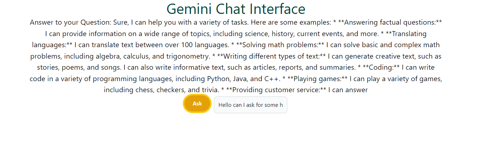

# Gemini Chat
### A simple interface to chat with the Gemini Pro API using ReactJs.


## How to run it:
***(Note: Use your own Gemini API key in the App.js file)***
Clone the repository and then use the commands below
```bash
> npm install
> npm start

```
